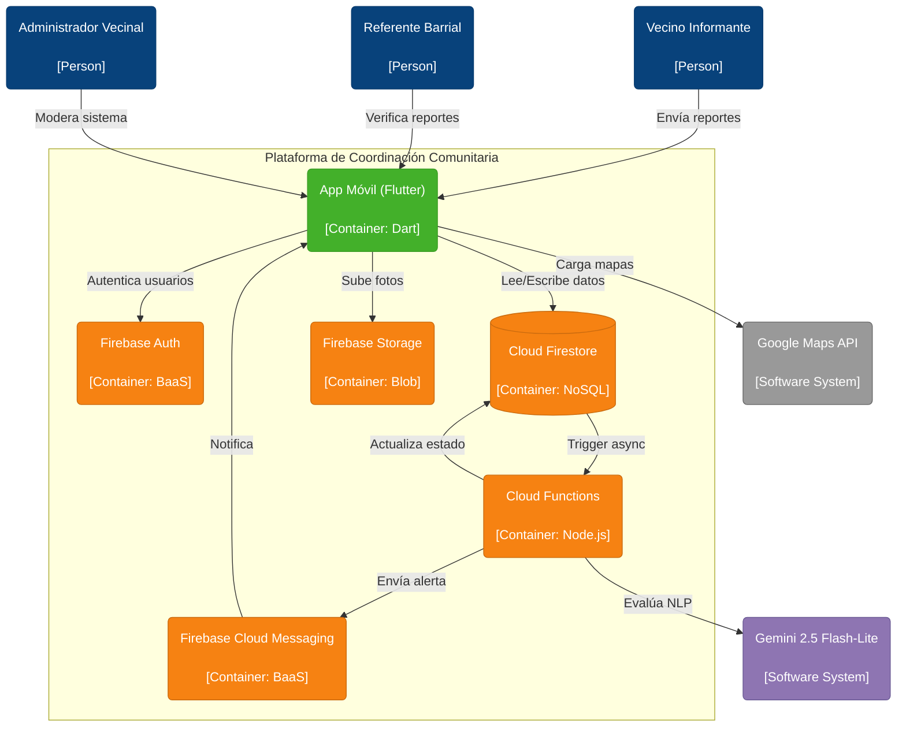
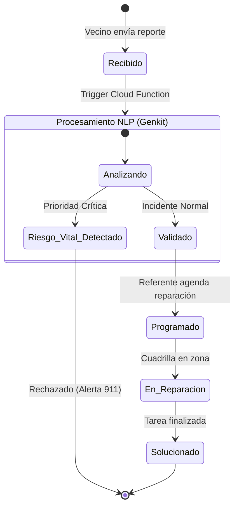
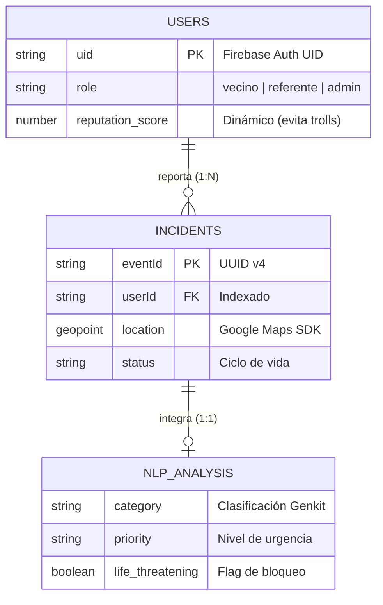
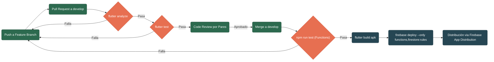

# App de Coordinación Comunitaria

   

Plataforma de ciencia ciudadana para el reporte de incidentes urbanos no críticos (baches, luminarias rotas, basura, cables sueltos). Actúa como puente entre los vecinos y la administración municipal/vecinal de forma eficiente y geo-referenciada.

> Proyecto académico — Grupo D, UNNOBA 2026.

---

## Descripción y Características Principales

El sistema permite a los vecinos reportar incidentes urbanos mediante texto, foto o voz. Un motor de NLP (Firebase Genkit + Gemini) procesa los reportes asíncronamente, los clasifica por categoría y prioridad, y notifica automáticamente a los referentes barriales correspondientes.

- **Speech-to-Text Offline**: Transcripción de voz a texto 100% *on-device* garantizando accesibilidad y privacidad sin costos de API externa.
- **GenAI Classification**: Motor de procesamiento de lenguaje natural utilizando Gemini 2.5 para asignar prioridades y clasificar la naturaleza del incidente en milisegundos.
- **Geolocalización In-App**: Renderizado nativo con Google Maps SDK y captura de coordenadas exactas del incidente.
- **Sistema de Reputación**: Scoring dinámico por usuario para mitigar reportes falsos y trolls.
- **Notificaciones Push**: Arquitectura orientada a eventos vía FCM para movilizar referentes barriales.

**Restricción Core:** el sistema **NO** es para emergencias de riesgo vital (incendios, crímenes, problemas de salud graves). Cualquier indicio de riesgo vital detectado por el motor NLP interrumpe el flujo y emite una alerta bloqueante sugiriendo el contacto inmediato al 911/107.

---

## Roles

| Rol | Descripción |
|---|---|
| **Vecino Informante** | Reporta incidentes urbanos |
| **Referente Barrial** | Verifica incidentes en campo, recibe alertas push |
| **Administrador Vecinal** | Modera reportes, gestiona estados y usuarios |

---

## Stack Tecnológico

| Capa | Tecnología |
|---|---|
| Frontend Mobile | Flutter (Dart) |
| Backend | Cloud Functions (Node.js/TypeScript) |
| IA / NLP | Firebase Genkit + Gemini 2.5 Flash-Lite |
| Base de datos | Cloud Firestore |
| Autenticación | Firebase Auth |
| Almacenamiento | Firebase Storage |
| Notificaciones | Firebase Cloud Messaging (FCM) |
| Reconocimiento de voz | `speech_to_text` (on-device, sin API externa) |
| Geolocalización | Google Maps SDK for Flutter |

---

## Equipos

| Equipo | Responsabilidad |
|---|---|
| **Equipo A** | Autenticación, roles y seguridad |
| **Equipo B** | Interfaz de usuario y captura de incidentes |
| **Equipo C** | NLP, lógica backend y notificaciones |

---

## Documentación

| Documento | Descripción |
|---|---|
| [docs/ARCHITECTURE.md](docs/ARCHITECTURE.md) | Diagramas de secuencia y flujos críticos de la plataforma |
| [docs/RUNBOOK.md](docs/RUNBOOK.md) | Manual operativo, métricas (SLIs) y troubleshooting (Playbooks) |
| [docs/DISASTER_RECOVERY.md](docs/DISASTER_RECOVERY.md) | Plan de contingencia, RPO/RTO y backups |
| [docs/adrs/](docs/adrs/) | Registros de Decisiones Arquitectónicas (ADRs) |
| [docs/setup.md](docs/setup.md) | Guía de instalación y configuración del entorno |
| [docs/WORKFLOW.md](docs/WORKFLOW.md) | Flujo de desarrollo y ciclo de vida de una tarea |
| [docs/BACKLOG.md](docs/BACKLOG.md) | Backlog sincronizado con Jira |
| [SECURITY.md](SECURITY.md) | Política de vulnerabilidades y modelo de seguridad |
| [CONTRIBUTING.md](CONTRIBUTING.md) | Convenciones de branches, commits y PRs |
| [AGENTS.md](AGENTS.md) | Instrucciones para agentes de IA |

---

## Arquitectura del Sistema

El sistema sigue una arquitectura serverless y event-driven basada en Firebase y Genkit:



### Ciclo de Vida del Incidente (Máquina de Estados)

Para entender cómo muta el estado de un reporte en la base de datos (según las reglas definidas en `docs/incident-event-schema.json`), se expone el siguiente diagrama de estados:



### Modelo de Datos (NoSQL Firestore)

Esquema central de colecciones y documentos persistidos en la base de datos, estructurado a partir del `EventoDeIncidente`:



### Pipeline de Integración Continua (CI/CD)

Flujo de entrega desde el commit local hasta el despliegue en producción, aplicable a los tres equipos del proyecto:



## Variables de Entorno

Para ejecutar correctamente el sistema en un entorno local o de CI/CD, se requiere configurar las siguientes variables de entorno (generalmente en un `.env` dentro de `functions/` o a nivel de sistema):

| Variable | Descripción | Entorno |
|---|---|---|
| `GEMINI_API_KEY` | Clave API de Google AI Studio para que Genkit procese NLP | Backend / Cloud Functions |
| `GOOGLE_MAPS_API_KEY` | Clave de Google Cloud Console habilitada para Maps SDK | Frontend (AndroidManifest.xml / AppDelegate.swift) |
| `FIREBASE_PROJECT_ID` | Identificador del proyecto en Firebase Console | Backend / CLI |

## Configuración (Setup) Paso a Paso

A continuación se detalla la configuración inicial mínima requerida. Para una guía exhaustiva (incluyendo resolución de problemas y herramientas), consulte [docs/setup.md](docs/setup.md).

1. **Clonar e instalar dependencias base**
   ```powershell
   git clone <repo-url>
   cd app-coordinacion-comunitaria
   flutter pub get
   ```

2. **Configuración de Firebase y Autenticación**
   Requiere Node.js y Flutter SDK.
   ```powershell
   npm install -g firebase-tools
   firebase login
   dart pub global activate flutterfire_cli
   flutterfire configure --project=<id-del-proyecto-firebase>
   ```

3. **Configuración de Google Maps**
   Insertar la `GOOGLE_MAPS_API_KEY` en `android/app/src/main/AndroidManifest.xml` (metadata `com.google.android.geo.API_KEY`).

4. **Generación de Código (Freezed / Riverpod / JSON)**
   ```powershell
   dart run build_runner build --delete-conflicting-outputs
   ```

5. **Ejecución de la Aplicación Móvil**
   Asegurarse de tener un emulador en ejecución y correr:
   ```powershell
   flutter run -d emulator-5554 --no-enable-impeller
   ```

6. **Despliegue Local del Backend (Opcional pero recomendado)**
   Para probar el motor NLP y funciones asociadas de manera local:
   ```powershell
   cd functions
   npm install
   npm run build
   firebase emulators:start
   ```

---

## Testing y Calidad de Código

El proyecto exige el cumplimiento riguroso de pruebas automáticas (Requisito `[T-TEST-06]`).

```powershell
# Ejecutar Linter (Reglas definidas en analysis_options.yaml)
flutter analyze

# Ejecutar Suite de Pruebas Unitarias y de Widgets
flutter test

# Pruebas de Backend (Cloud Functions)
cd functions
npm run test
```

> **Nota Arquitectónica**: Las pruebas de UI y de lógica de dominio (NLP) están desacopladas siguiendo principios de Clean Architecture y SOLID.

---

## CI/CD

| Evento | Acción |
|---|---|
| PR abierto hacia `main` o `develop` | Valida título, corre `flutter analyze` y `flutter test` |
| Merge a `main` | Build del APK de release + deploy de Firestore rules si cambiaron |
| Cualquier PR | Auto-labeling según archivos modificados |

---

## Estructura del proyecto (Monorepo Lógico)

```
app-coordinacion-comunitaria/
├── lib/
│   ├── app/                  # GoRouter y Provider Scope (Configuración global)
│   ├── core/                 # Constantes, errores, temas y widgets compartidos
│   └── features/             # Feature-first architecture
│       ├── auth/             # Autenticación y roles (Equipo A)
│       ├── incidents/        # Creación y tracking de reportes (Equipo B)
│       ├── map/              # Mapa interactivo de incidencias (Equipo B)
│       └── admin/            # Dashboard de moderación vecinal (Equipo A)
├── functions/                # Backend Node.js / TypeScript (Cloud Functions y Genkit)
├── docs/                     # Documentación arquitectónica, ADRs y Runbooks
├── .github/workflows/        # Pipelines CI/CD con GitHub Actions
└── firestore.rules           # Reglas declarativas de seguridad de BD
```
