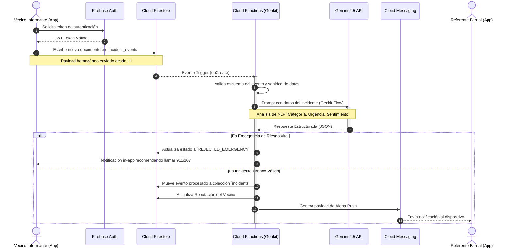

# Arquitectura del Sistema — Vistas Dinámicas

Este documento detalla el comportamiento asíncrono y la interacción en tiempo real entre los componentes del sistema, proporcionando una vista de procesos sobre la plataforma.

## Flujo Crítico: Reporte y Procesamiento de Incidente

Este diagrama ilustra el flujo de extremo a extremo que ocurre desde el momento en que un Vecino Informante envía un reporte, hasta que el Referente Barrial es notificado.

El sistema debe garantizar que todo este ciclo (excluyendo la latencia de red del usuario) se complete en menos de **10 segundos**, según los Requisitos No Funcionales (RNF).

## Políticas de Resiliencia del Flujo

1. **Idempotencia**: Las Cloud Functions están configuradas para manejar reintentos automáticos. Utilizan el `eventId` como clave de idempotencia para evitar procesar el mismo reporte dos veces si Firebase Cloud Messaging falla y reintenta el trigger.
2. **Degradación Elegante**: Si el servicio de Gemini API experimenta caídas, la Cloud Function aplicará una clasificación por defecto de "Prioridad Baja" y categorización "No Definida", insertando el incidente en una cola de revisión manual para los Administradores Vecinales, evitando bloquear la experiencia del usuario.
3. **Escalado**: Al utilizar Cloud Functions Gen 2 (basadas en Cloud Run), las instancias escalan a cero cuando no hay tráfico y permiten concurrencia múltiple por instancia para mitigar *Cold Starts*.
